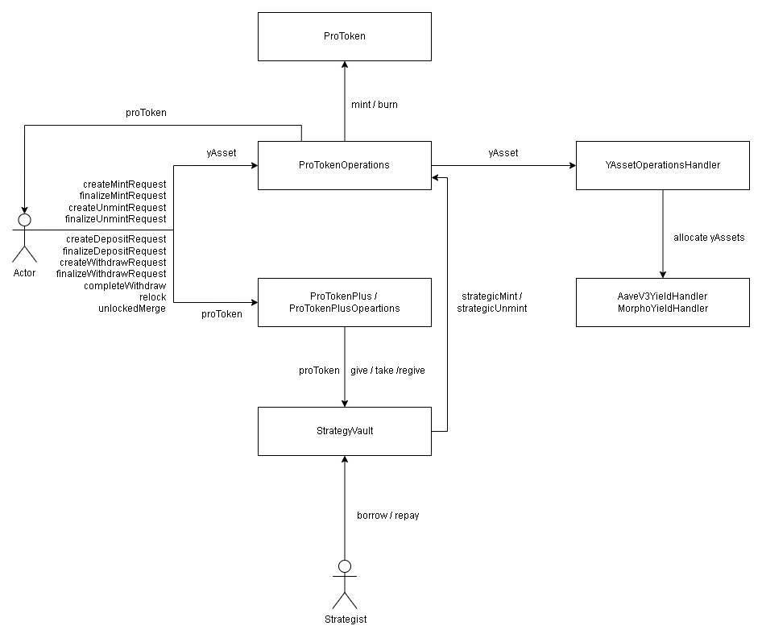

# Promis - Contracts

## Project Overview

Promis is a yield-bearing token protocol built around **proUSD**, a token whose USD value accrues over time from yield generated on the assets backing it. The protocol has three layers:

1. **proUSD (core).** Users mint proUSD by depositing a yield-bearing asset (yAsset — USDT, USDC, DAI) and unmint to redeem the underlying yAsset back. Mint and unmint follow a *request → backend-signed proof → finalize* pattern; unmints settle in batches. The deposited yAssets are routed to external yield protocols (Aave V3, Morpho) to generate the return that makes proUSD appreciate.

2. **proUSD+ (vaults/ProTokenPlus).** A locking vault on top of proUSD. Holders lock proUSD into a tier (e.g. Semi-Annual, Annual) to earn an additional fixed-APR reward over a lock period, with the reward computed and locked in at deposit time. Positions can be withdrawn (after an unbonding period), relocked into a new tier, or merged. Deposit/withdraw also use the request → proof → finalize pattern; relock and merge are direct calls.

3. **StrategyVault (vaults/ProTokenPlus).** The custody layer behind proUSD+. When proUSD is locked it is forwarded to the StrategyVault, which holds it and lets a privileged **strategist** deploy the principal into yield venues (`borrow`) and return value to fund user exits (`repay`). Protocol growth from proUSD appreciation and the protocol's share of strategist-generated yield are claimable by the **admin**.

Supporting layers:

- **Oracles** — a Chainlink push-oracle adaptor that normalizes external price feeds into the protocol's internal 18-decimal convention.
- **Yields** — per-protocol yield handlers (Aave V3, Morpho) that the yAsset operations handler allocates deposited yAssets across.

The protocol is upgradeable (UUPS proxies) with logic, state, and types separated into dedicated files per module so storage layout stays stable across upgrades. Security-sensitive token movements are gated behind an off-chain authority signature (EIP-712), and the proUSD+ user operations are executed through a delegatecall satellite (`ProTokenPlusOperations`) to keep the main contract within size limits.

## High Level Architecture Diagram



Flow summary:

- **Mint/unmint** go through `ProTokenOperations`, which mints/burns `ProToken` (proUSD) and routes yAssets via `YAssetOperationsHandler` into the yield handlers (`AaveV3YieldHandler` / `MorphoYieldHandler`). Unmint payouts are batched through `ProTokenUnmintHandler`.
- **Deposit/withdraw/relock/merge** go through `ProTokenPlus` / `ProTokenPlusOperations`, which moves proUSD in/out of `StrategyVault` (`give` on deposit, `take` on withdraw, `regive` on relock).
- **The strategist** draws principal from `StrategyVault` (`borrow`) and returns value (`repay`); the vault converts proUSD ↔ yAsset through `ProTokenOperations` via `strategicMint` / `strategicUnmint`.

## Local Testing

### Start local test node

```
npx hardhat node
```

### Run tests

```
npx hardhat test
```

## Folder Structure

- `contracts/`: Solidity source code for the protocol.
  - `core/`: Core proUSD modules — the token, its mint/unmint operation lifecycle, batched unmint settlement, protocol settings, and yAsset operations.
    - `ProToken.sol`: The proUSD ERC-20 token.
    - `ProTokenOperations.sol`: Mint/unmint request lifecycle (request → proof → finalize).
    - `ProTokenSettings.sol`: Shared protocol registry — contract addresses, yAsset config, proof-signing authority, strategist role, pause state.
    - `ProTokenUnmintHandler.sol`: Batched yAsset payouts after unmint.
    - `YAssetOperationsHandler.sol`: Routes deposited yAssets across the yield handlers and serves unmint/borrow payouts from reserve.
    - `interfaces/`: External/public interfaces for the core modules.
    - `state/`: Storage-layout contracts (`ProTokenOperationsState`, `ProTokenSettingsState`, `ProTokenUnmintHandlerState`, `YAssetOperationsHandlerState`) separating data from logic for upgrade safety.
    - `types/`: Shared structs/enums (`ProTokenOperationsTypes`, `ProTokenSettingsTypes`, `ProTokenUnmintHandlerTypes`, `YAssetOperationsHandlerTypes`).
  - `oracles/`: Oracle adaptor layer that normalizes external feeds into the protocol's 18-decimal pricing.
    - `OracleChainlinkPushAdaptor.sol`: Chainlink push-oracle adaptor.
    - `interfaces/`: Adaptor interfaces.
    - `state/`: `OracleChainlinkPushAdaptorState`.
    - `types/`: `OracleAlgebraAdaptorTypes` (shared oracle types).
  - `vaults/ProTokenPlus/`: The proUSD+ locking product and its custody vault.
    - `ProTokenPlus.sol`: proUSD+ locking vault — manages tiers, positions, deposits, withdrawals, relock, and merge. Delegatecalls the satellite for user-operation logic.
    - `ProTokenPlusOperations.sol`: Delegatecall satellite holding the user-operation logic (deposit/withdraw/relock/merge). Shares storage layout with `ProTokenPlusState`; never called directly (guarded by `onlyDelegatecall`).
    - `StrategyVault.sol`: Custody contract that holds locked proUSD. Strategist `borrow`/`repay`; admin growth/yield claims; reserve rotation (`regive`) on relock.
    - `UPGRADE_GUIDE.md`: Upgrade notes for this module.
    - `interfaces/`: `IProTokenPlus`, `IProTokenPlusOperations`, `IStrategyVault`.
    - `state/`: `ProTokenPlusState`, `StrategyVaultState` (storage layouts; `ProTokenPlusState` is shared by the satellite via delegatecall).
    - `types/`: `ProTokenPlusTypes` (positions, tiers, requests, enums).
  - `yields/`: Yield-protocol integration and accounting.
    - `AaveV3YieldHandler.sol`: Aave V3 integration.
    - `MorphoYieldHandler.sol`: Morpho integration.
    - `interfaces/`: Yield handler interfaces.
    - `state/`: `AaveV3YieldHandlerState`, `MorphoYieldHandlerState`.
  - `test/`: Solidity mocks and helpers used by the TS tests (mock pools, tokens, aggregators, upgrade targets, reentrancy/revert helpers).
- `test/`: Hardhat tests organized by domain.
  - `unit/core/`: Unit tests for the core proUSD contracts — token, operations, settings, unmint handler, yAsset operations.
  - `unit/oracles/`: Unit tests for the oracle adaptor(s) and proxies.
  - `unit/vaults/`: Unit tests for ProTokenPlus, ProTokenPlusOperations, and StrategyVault (locking, withdraw/unbonding, relock rotation, merge, deposit cap, `totalDepositsBase` invariant, vault solvency).
  - `unit/yields/`: Unit tests for the yield handlers and yAsset operations.
```